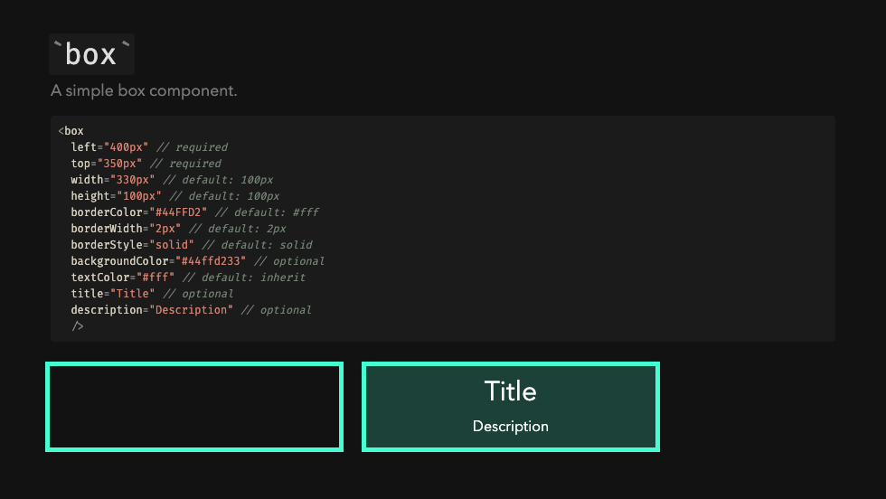
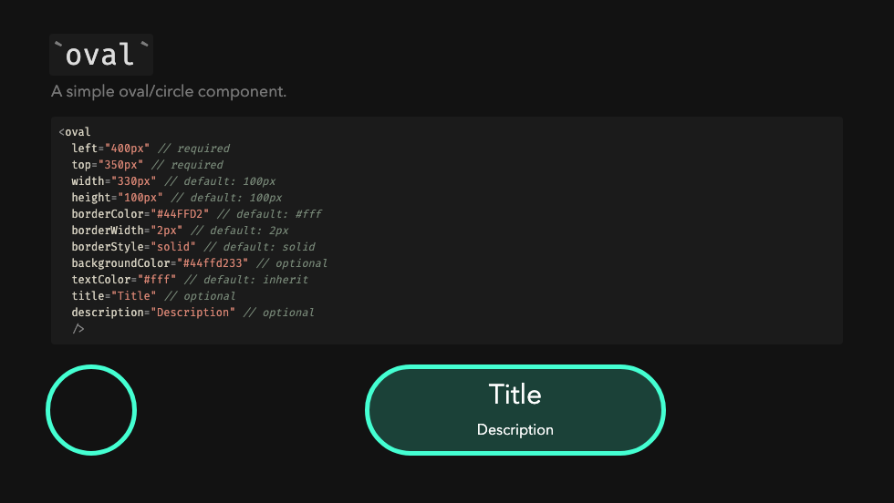
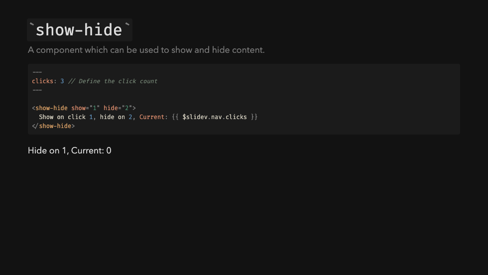

# Slidev Addon - Components

[](https://www.npmjs.com/package/slidev-addon-components)

A collection of components for [Slidev](https://sli.dev/).

## Usage

Install the package:

```bash
npm i slidev-addon-components
```

Declare the addons either in your front matter of your `slides.md` file:

```yaml
addons:
  - slidev-addon-components
```

Or in your `package.json` file:

```json
{
  "slidev": {
    "addons": [
      "slidev-addon-components",
    ]
  }
}
```


## Components

The following components are available:

- `box`: A simple box/rectangle component.
- `oval`: A simple oval/circle component.
- `show-hide`: A component which can be used to show and hide content.

### Box

A simple box component.

```jsx
<box 
  left="400px" // required
  top="350px" // required 
  width="330px" // default: 100px
  height="100px" // default: 100px  
  borderColor="#44FFD2" // default: #fff 
  borderWidth="2px" // default: 2px
  borderStyle="solid" // default: solid 
  backgroundColor="#44ffd233" // optional 
  textColor="#fff" // default: inherit 
  title="Title" // optional 
  description="Description" // optional 
  />
```



### Oval

A simple oval/circle component.

```jsx
<oval 
  left="400px" // required
  top="350px" // required 
  width="330px" // default: 100px
  height="100px" // default: 100px  
  borderColor="#44FFD2" // default: #fff 
  borderWidth="2px" // default: 2px
  borderStyle="solid" // default: solid 
  backgroundColor="#44ffd233" // optional 
  textColor="#fff" // default: inherit 
  title="Title" // optional 
  description="Description" // optional 
  />
```



### Show/Hide

A component which can be used to show and hide content.

```jsx
---
clicks: 3 // Define the click count
---

<show-hide show="1" hide="2">
  Show on click 1, hide on 2, Current: {{ $slidev.nav.clicks }}
</show-hide>
```




<br />
<br />

[](https://visitorbadge.io/status?path=https%3A%2F%2Fgithub.com%2Festruyf%2Fslidev-addon-components)